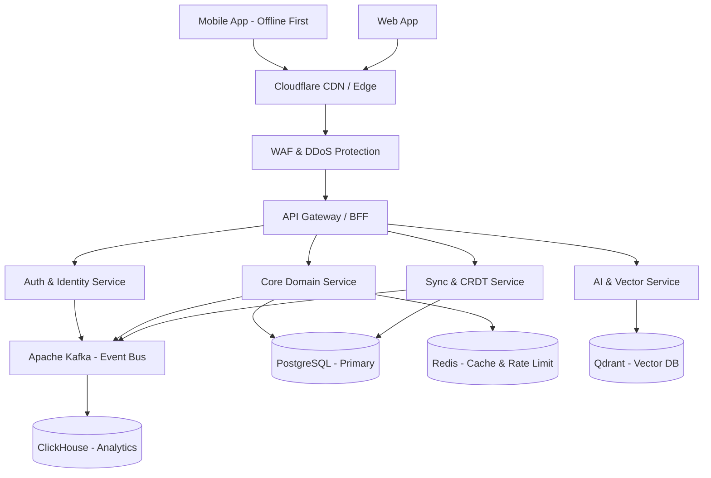

# World-Class Software Architecture Blueprint

## 1. Executive Architecture Overview

This document outlines a production-grade, highly scalable, and offline-first software architecture designed for a top-tier technology product. Inspired by engineering practices at companies like Stripe, Linear, and Notion, this architecture prioritizes developer experience (DX), extreme performance, robust offline capabilities, and horizontal scalability. The system utilizes a modern, strongly-typed stack: **TypeScript/Next.js (Web)**, **React Native/Expo (Mobile)**, **Go (High-Performance Services)**, **Node.js (BFF/Real-time)**, and **PostgreSQL (Primary Datastore)**, orchestrated via **Kubernetes** and an **Event-Driven Kafka backbone**.

## 2. High-Level System Architecture

The architecture follows a modular monolith or macro-service approach initially, with clear domain boundaries, evolving into microservices for specific high-load domains.



## 3. End-to-End Request Flow

1. **Client Request**: A user interacts with the UI. For offline clients, mutations are immediately applied to the local database (optimistic UI) and queued for background synchronization.
2. **Edge Network**: The request hits Cloudflare (CDN). Static assets are served immediately. API requests pass through the WAF.
3. **API Gateway (BFF)**: The request hits the Backend-For-Frontend. The gateway terminates SSL, verifies JWT tokens via the Auth Service, applies rate limiting (Redis), and routes the request.
4. **Service Processing**: The domain service processes the business logic. It checks the Redis cache first; on a cache miss, it queries PostgreSQL.
5. **Event Emission**: If a mutation occurs, the service updates PostgreSQL and emits a domain event to Kafka (via the Outbox pattern).
6. **Background/Async**: Consumers of the Kafka topic process the event (e.g., updating search indexes, sending push notifications, updating analytics in ClickHouse).
7. **Response**: The service responds to the gateway, which forwards it to the client.

## 4. Frontend Architecture

### Web (Next.js & React)
- **Framework**: Next.js (App Router) for SSR/SSG capabilities, exceptional SEO, and optimized initial load times.
- **Language**: TypeScript (Strict mode).
- **Styling**: Tailwind CSS combined with Radix UI (Headless components) for highly accessible, customizable, and rapid UI development.

### Mobile (React Native + Expo)
- **Framework**: Expo (React Native) utilizing the New Architecture (Fabric & TurboModules).
- **Why**: Allows code sharing between web and mobile (business logic) while delivering near-native performance. Over-the-air (OTA) updates via Expo EAS.

### Desktop (Electron / Tauri)
- **Framework**: Tauri (Rust + React).
- **Why**: Vastly lower memory footprint compared to Electron, leveraging the same web codebase.

## 5. UI Rendering Architecture

- **Web**: Server-Side Rendering (SSR) for initial loads (fast LCP, SEO). Client-side hydration for subsequent interactivity. React Server Components (RSC) to reduce client JavaScript bundle size.
- **Mobile**: Native rendering via React Native Fabric. List views utilize `FlashList` for 60fps scrolling performance, avoiding memory bloat common in standard `FlatList`.

## 6. State Management Strategy

- **Server State / Data Fetching**: TanStack Query (React Query). Handles caching, deduping, background fetching, and optimistic updates.
- **Client/Local State**: Zustand. Extremely lightweight, unopinionated, and avoids the boilerplate of Redux.
- **Form State**: React Hook Form with Zod for validation.

## 7. Offline-First Architecture

Inspired by Linear, the application must work seamlessly without an internet connection.
- **Mobile**: WatermelonDB. An observable, reactive SQLite database designed for React Native. It handles millions of records smoothly by lazily loading data.
- **Web**: RxDB or IndexedDB + OPFS (Origin Private File System).
- **Architecture**: The UI *only* subscribes to the local database. When a user makes a change, it mutates the local DB immediately. The local DB then queues a sync task to push changes to the server.

## 8. Data Synchronization Strategy

- **Mechanism**: CRDTs (Conflict-free Replicated Data Types) combined with a Sync Engine.
- **Protocol**: HTTP polling for initial load, WebSockets for real-time deltas.
- **Conflict Resolution**: Server is the source of truth, but CRDTs (e.g., using Yjs or Automerge concepts) ensure that concurrent edits (e.g., in a collaborative editor) merge deterministically without data loss.
- **WatermelonDB Sync**: Uses a `last_pulled_at` timestamp. The server returns changes since that timestamp. The client sends a queue of local mutations.

## 9. API Architecture

- **Internal Service-to-Service**: gRPC (Protocol Buffers). Strongly typed, exceptionally fast, and low network overhead.
- **External / Client-to-Server**: GraphQL (Federated) or tRPC.
  - *Decision*: **tRPC** for the Web Monorepo (where frontend and BFF share the exact same TS types). **GraphQL** for Mobile and external public APIs to allow clients to specify exactly what data they need, reducing over-fetching.

## 10. Backend Architecture

- **Primary Language**: Go (Golang). Used for domain services (User, Billing, Core Engine). Go provides excellent concurrency, low memory footprint, and fast compile times.
- **BFF / Real-time Gateway**: Node.js (TypeScript). Excellent for handling WebSockets and integrating deeply with the frontend monorepo.
- **Pattern**: Modular Monolith transitioning to Event-Driven Microservices. We avoid premature microservices but enforce strict domain boundaries (Domain-Driven Design) within the Go repository.

## 11. Service Layer Design

Services are designed using Hexagonal Architecture (Ports and Adapters).
1. **Transport Layer**: HTTP/gRPC handlers.
2. **Service/Use Case Layer**: Pure business logic.
3. **Repository/Adapter Layer**: Interacts with the DB, external APIs.
*Benefit*: Business logic is entirely decoupled from the database and transport, making it 100% unit-testable.

## 12. Domain-Driven Design (DDD)

- **Bounded Contexts**: Clear separation of concerns (e.g., `Identity`, `Billing`, `Workspace`, `Collaboration`).
- **Ubiquitous Language**: Engineering and Product share the exact same terminology in code and documentation.
- **Aggregates**: Transactional boundaries are strictly defined. A mutation to a `Workspace` aggregate is a single atomic transaction.

## 13. Database Architecture

- **Primary Relational**: PostgreSQL (Aurora/Cloud SQL). Handles 90% of workloads. ACID compliant, mature, extensible (PostGIS, pgvector).
- **Connection Pooling**: PgBouncer or Prisma Accelerate/Supabase pooling to prevent connection starvation.
- **Analytics/OLAP**: ClickHouse. Ingests millions of events per second for product analytics and reporting.
- **Caching/KV**: Redis. For session data, rate limit counters, and expensive query caching.

## 14. Caching Strategy

- **L1 Cache (In-Memory)**: LRU cache within the service application memory for highly accessed, rarely changing data (e.g., feature flags).
- **L2 Cache (Distributed)**: Redis.
- **Invalidation**: Cache invalidation is notoriously hard. We use Event-Driven Invalidation. When a PostgreSQL record is updated, a Debezium CDC (Change Data Capture) event triggers a worker to delete the associated Redis key.

## 15. Search Architecture

- **Engine**: Elasticsearch or Typesense. Typesense is preferred for typo-tolerant, lightning-fast instant search (Algolia alternative without the cost).
- **Indexing**: Driven by Kafka. When an entity changes in Postgres, the event is consumed by a Search Indexer service that updates Typesense, ensuring search is always eventually consistent.

## 16. Vector Database Architecture (AI Features)

- **Database**: Qdrant or Pinecone. (Qdrant preferred for self-hosting/cost control; it is written in Rust and extremely fast).
- **Usage**: Storing embeddings generated by OpenAI/Cohere for semantic search, recommendation engines, and RAG (Retrieval-Augmented Generation).

## 17. AI Gateway Architecture

- **Component**: A dedicated AI Gateway service (e.g., using Cloudflare AI Gateway or a custom Go proxy).
- **Purpose**:
  - Semantic Caching: Cache identical LLM prompts to save costs.
  - Fallbacks: If OpenAI fails, automatically route to Anthropic or local open-source models.
  - Rate Limiting & Cost Tracking per tenant.

## 18. Authentication & Authorization

- **Authentication**: JWT-based access tokens (short-lived, 15 mins) and opaque refresh tokens (stored in HTTP-only, secure cookies). OIDC integration for Google/Apple SSO.
- **Authorization**: Role-Based Access Control (RBAC) combined with Attribute-Based Access Control (ABAC) implemented via Google Zanzibar inspired systems (e.g., SpiceDB or OpenFGA) for highly granular, scalable permissions (e.g., "User A has editor access to Document B in Workspace C").

## 19. File Storage Architecture

- **Storage**: AWS S3 (or Cloudflare R2 for zero egress fees).
- **Upload Flow**: Clients request a Pre-signed URL from the API. The client uploads the file directly to S3/R2. S3 triggers an event to a serverless function (AWS Lambda) to generate thumbnails or process video, updating the DB when complete.

## 20. CDN Strategy

- **Provider**: Cloudflare.
- **Strategy**: Aggressive caching of static assets at the edge. Utilizing Cloudflare Workers for edge-level routing, A/B testing, and localized personalization before requests even hit our origin servers.

## 21. Real-Time Communication

- **Protocol**: WebSockets via Socket.io or natively with Go (`gorilla/websocket`).
- **Scale**: A dedicated pub/sub backplane (Redis Pub/Sub) allows WebSocket servers to scale horizontally. When User A (Node 1) sends a message, it publishes to Redis, and Node 2 receives it and pushes to User B.

## 22. Event-Driven Architecture

- **Message Broker**: Apache Kafka.
- **Pattern**: Transactional Outbox Pattern. To prevent dual-write problems, services write business data and a domain event to PostgreSQL in the *same transaction*. A Debezium connector reads the Postgres WAL (Write-Ahead Log) and pushes the event to Kafka. This guarantees at-least-once delivery.

## 23. Background Jobs

- **System**: Temporal.io (or BullMQ for simple TS stacks).
- **Why Temporal**: It allows writing complex, long-running asynchronous workflows in standard code. It handles retries, state management, and failures seamlessly. Perfect for multi-step processes like user onboarding, video encoding, or billing cycles.

## 24. Message Queue Architecture

- **High Throughput/Events**: Kafka (Log-based, replayable).
- **Task Queues/Delayed Execution**: Amazon SQS or RabbitMQ. SQS is used for simple point-to-point worker tasks (e.g., sending an email) where replayability isn't required.

## 25. Notification System

- **Channels**: Push (APNs/FCM), Email (Resend/SendGrid), In-App.
- **Architecture**: A centralized Notification Service listens to Kafka events. It maintains user preferences (e.g., "mute emails for this thread") and batches notifications to prevent spamming users.

## 26. Analytics Architecture

- **Telemetry**: OpenTelemetry for standardizing data collection.
- **Pipeline**: Client events -> API Gateway -> Kafka -> ClickHouse.
- **Why ClickHouse**: It can aggregate billions of rows in milliseconds, enabling real-time, user-facing analytics dashboards.

## 27. Logging Architecture

- **Format**: Structured JSON logging exclusively.
- **Stack**: PLG Stack (Promtail, Loki, Grafana) or Datadog. Loki is highly cost-effective because it only indexes metadata/labels, not the full text of the log.

## 28. Monitoring & Observability

- **Metrics**: Prometheus (Time-series data for CPU, memory, request rates).
- **Tracing**: Jaeger or Datadog APM. Distributed tracing is injected via standard HTTP headers (W3C Trace Context) to trace a request from Mobile App -> Gateway -> Service A -> DB.
- **Dashboards**: Grafana for centralized visibility.

## 29. Error Handling Strategy

- **Client**: Global Error Boundaries in React. Retry logic embedded in TanStack Query.
- **Server**: Standardized RFC 7807 Problem Details for HTTP APIs.
- **Tracking**: Sentry for tracking unhandled exceptions, sourcemaps mapped to releases to pinpoint exact lines of code causing crashes.

## 30. Security Architecture

- **Data at Rest**: AES-256 encryption for DB and S3.
- **Data in Transit**: TLS 1.3 everywhere.
- **WAF**: Cloudflare WAF to block SQLi, XSS, and malicious bots.
- **PII**: Personally Identifiable Information is tokenized or stored in a separate, highly restricted database vault.

## 31. Rate Limiting

- **Edge Layer**: Cloudflare rate limits based on IP/ASN.
- **Application Layer**: Token Bucket algorithm implemented in Redis. Rate limits are applied per User ID and per API Key, with distinct limits for different endpoints (e.g., `/login` is stricter than `/data`).

## 32. API Versioning Strategy

- **Approach**: Stripe-style URL versioning combined with Header versioning (`/v1/users`).
- **Evolution**: APIs never break. If a response structure changes, a new API version is minted, and an internal middleware layer maps older version requests to the new internal domain logic.

## 33. Feature Flag System

- **Tool**: LaunchDarkly or GrowthBook.
- **Usage**: All new features are wrapped in flags. This enables Trunk-Based Development, Canary Releases (rollout to 1% of users), and instantaneous rollbacks without deploying code.

## 34. Configuration Management

- **Environments**: Strict separation of Dev, Staging, and Prod.
- **Management**: Environment variables injected via Kubernetes ConfigMaps and HashiCorp Vault.

## 35. Secrets Management

- **Tool**: HashiCorp Vault or AWS Secrets Manager.
- **Flow**: Code never contains secrets. Applications authenticate with Vault at startup via IAM roles to fetch required DB passwords and API keys into memory.

## 36. CI/CD Pipeline

- **CI**: GitHub Actions. On Push: Linter, Prettier, Type Check, Unit Tests.
- **CD**: On Merge to `main`: Integration Tests -> Docker Image Build -> Push to ECR -> ArgoCD detects new image and automatically deploys to Kubernetes.

## 37. Git Strategy

- **Workflow**: Trunk-Based Development.
- **Branches**: Short-lived feature branches branching from `main`. PRs must be small and pass all checks. No long-running `develop` branches.

## 38. Monorepo Structure

- **Tool**: Turborepo or Nx.
- **Structure**:
  ```
  apps/
    web/        (Next.js)
    mobile/     (Expo)
    api-gateway/(Node.js)
  packages/
    ui/         (Shared React Components)
    db/         (Prisma schema, migrations)
    types/      (Shared Zod schemas and TS interfaces)
    eslint/     (Shared config)
  services/
    core/       (Go)
    billing/    (Go)
  ```

## 39. Package Management

- **Tool**: `pnpm`. Faster and highly efficient with disk space due to global store and hard links. Perfect for monorepos.

## 40. Shared Libraries Strategy

- Code sharing is strictly bounded. UI components and TypeScript types are shared. Business logic is *not* shared between frontend and backend to avoid tight coupling. Backend microservices do *not* share database models; they communicate via APIs/Events.

## 41. Infrastructure as Code (IaC)

- **Tool**: Terraform.
- **Scope**: Every AWS resource, DB, and networking rule is defined in HCL. Infrastructure changes are peer-reviewed via PRs (GitOps).

## 42. Cloud Architecture

- **Provider**: AWS.
- **Compute**: Amazon EKS (Kubernetes) for services. AWS Lambda for isolated, burstable background tasks (e.g., image resizing).

## 43. Multi-Region Deployment

- **Initial**: Single region (e.g., `us-east-1`) with multiple Availability Zones (AZs) for high availability.
- **Future Scale**: Active-Active multi-region. CockroachDB or AWS Aurora Global Database for cross-region data replication. Geo-routing via Route 53 to send users to the closest region.

## 44. Disaster Recovery

- **RPO (Recovery Point Objective)**: 5 minutes.
- **RTO (Recovery Time Objective)**: 1 hour.
- **Strategy**: Infrastructure is reproducible via Terraform. Databases utilize Point-in-Time Recovery (PITR).

## 45. Backup Strategy

- **PostgreSQL**: Automated continuous WAL archiving to S3, allowing restoration to any exact second in the last 30 days. Daily snapshot backups.
- **Testing**: Automated scripts restore the DB to a staging environment weekly to verify backup integrity.

## 46. Scaling Strategy

- **1K Users**: Monolith API, Single Postgres instance, Serverless Frontend.
- **10K Users**: Add Read Replicas to Postgres. Introduce Redis for caching.
- **100K Users**: Separate core logic into dedicated Go services. Introduce Kafka for async processing.
- **1M Users**: Shard the database (tenant-based). EKS Horizontal Pod Autoscaling based on CPU/Memory.
- **10M Users**: Multi-region active-active deployment. Dedicated ClickHouse cluster for analytics.
- **100M Users**: Custom caching layers, massive database sharding (Vitess), specialized edge computing.

## 47. Cost Optimization

- **Compute**: Use ARM processors (AWS Graviton) for a 20-30% price-performance benefit. Use Spot Instances for background workers.
- **Egress**: Cloudflare R2 for asset serving to eliminate AWS S3 egress fees.
- **DB**: Aggressively archive old data from Postgres to cheaper S3 object storage.

## 48. Performance Optimization (Backend)

- Use connection pooling (PgBouncer).
- N+1 Query prevention via GraphQL DataLoaders.
- Indexing strategy (B-Tree, BRIN, GIN for text). Explain/Analyze on all slow queries.

## 49. Mobile Performance Strategy

- **Engine**: Hermes JS Engine for fast startup.
- **UI**: Reanimated for UI thread animations (bypassing the JS bridge). FlashList for rendering.
- **Network**: Batch API requests. Offline-first design masks network latency completely.

## 50. Web Performance Strategy

- **Assets**: Next.js Image component for automatic WebP/AVIF conversion and lazy loading.
- **Fonts**: Self-hosted variable fonts via `next/font`.
- **Bundle**: Dynamic imports (`next/dynamic`) to split code and only load components when they enter the viewport.

## 51. Database Optimization

- Implement pagination using Keyset Pagination (Cursor-based) instead of `OFFSET/LIMIT` to maintain performance on massive tables.
- Partition massive tables (e.g., `logs`, `events`) by date.

## 52. AI Cost Optimization

- **Semantic Cache**: Store past LLM prompts and responses in Redis.
- **Model Routing**: Route simple tasks to cheaper models (e.g., Claude 3 Haiku / GPT-4o-mini) and reserve expensive models (GPT-4) for complex reasoning.

## 53. Testing Strategy

- **Unit Tests**: Jest/Vitest for TS, native `testing` for Go. Aim for 80% coverage on business logic.
- **Integration Tests**: Testcontainers to spin up ephemeral Postgres/Redis Docker containers during CI to test real DB queries.
- **E2E Tests**: Playwright for web. Detox for React Native.
- **Load Testing**: k6.io to simulate thousands of concurrent users.
- **Chaos Engineering**: Randomly terminate pods in staging to ensure self-healing capabilities.

## 54. Release Strategy

- **Phased Rollout**: 1% -> 10% -> 50% -> 100% via LaunchDarkly.
- **Mobile**: Expo OTA updates for JS bundle fixes. Staged native rollouts via App Store/Play Store consoles.

## 55. Migration Strategy

- **Zero-Downtime DB Migrations**: 
  1. Add new column.
  2. Deploy code to write to both old and new.
  3. Backfill old data.
  4. Deploy code to read from new.
  5. Drop old column.

## 56. Tech Debt Prevention

- **Automated**: strict ESLint rules, SonarQube for static analysis.
- **Process**: 20% of every sprint is dedicated to refactoring, dependency updates, and addressing performance bottlenecks.

## 57. Coding Standards

- **Principles**: DRY, SOLID, and explicit over implicit.
- **Types**: `any` is strictly forbidden in TypeScript.
- **Formatting**: Prettier enforces standard formatting automatically on pre-commit hooks (Husky).

## 58. Folder Structure (Next.js Example)
```
src/
  app/          (Routing, Layouts)
  components/   (UI primitives)
  features/     (Domain-specific modules, e.g., features/auth)
  lib/          (Third-party wrappers, e.g., axios, utils)
  server/       (tRPC routers, DB access)
  store/        (Zustand stores)
```

## 59. Recommended Tech Stack Summary

| Layer | Technology | Why over Alternatives? |
|-------|------------|------------------------|
| **Web** | Next.js + React | Superior to SPA React (Vite) due to SEO, SSR, and built-in optimizations. |
| **Mobile** | React Native (Expo) | Superior to Flutter due to OTA updates and shared web TS codebase. |
| **Styling** | Tailwind CSS | Superior to CSS-in-JS (Styled Components) in runtime performance. |
| **Backend Core** | Go | Superior to Python/Node for compute-heavy, concurrent microservices. |
| **BFF** | Node.js (TS) | Best ecosystem for GraphQL/tRPC integration with frontends. |
| **Primary DB** | PostgreSQL | Superior to MongoDB; relational data fits most business models better. |
| **Cache** | Redis | Industry standard, vastly faster than DB for key-value ops. |
| **Message Bus** | Kafka | Superior to RabbitMQ for log replayability and massive throughput. |
| **Mobile DB** | WatermelonDB | Superior to CoreData/SQLite direct for reactive, lazy-loaded UI binding. |

## 60. Final Architectural Justification

This architecture is chosen because it perfectly balances **rapid product iteration** (via the TypeScript/Next.js/Expo monorepo) with **enterprise-grade scalability** (via Go, Kafka, and Postgres). 

By adopting an offline-first mobile strategy with WatermelonDB and CRDTs, we guarantee an exceptional user experience regardless of network conditions, instantly differentiating the product from standard web-wrapped applications. The event-driven backend ensures that as the product grows, new features (like search indexing or analytics) can be bolted on without modifying or slowing down the core transaction paths.

This is the blueprint for a system that will scale gracefully from Day 1 to 100 Million Users.
